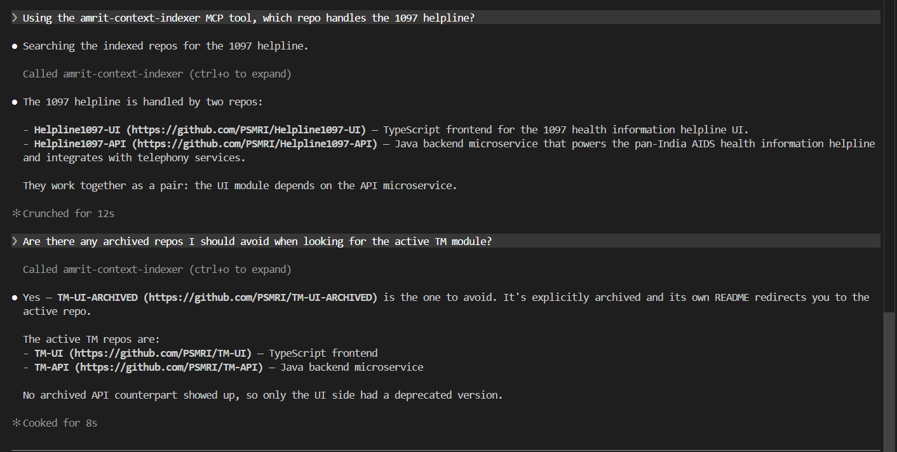
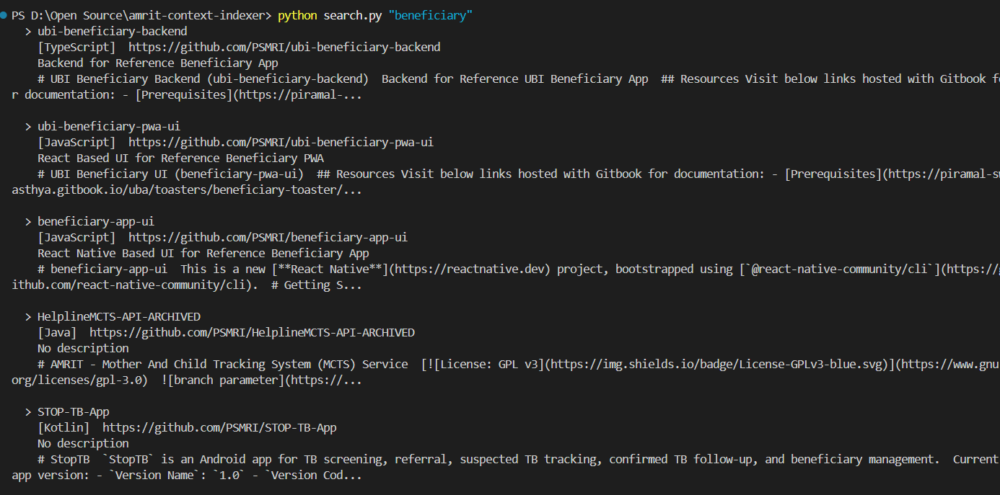
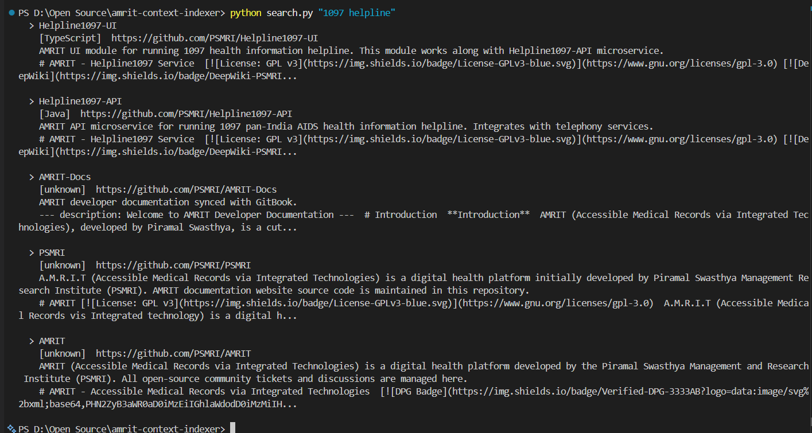
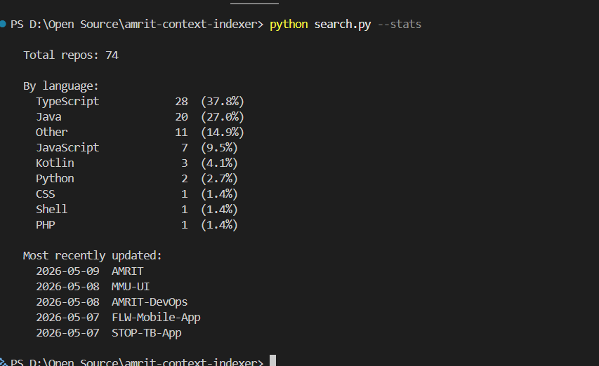
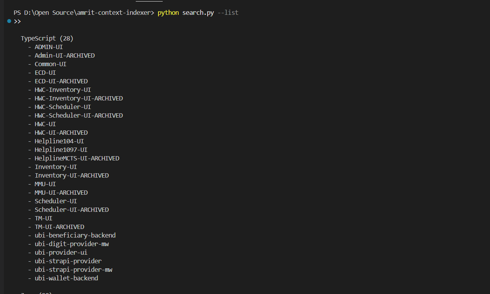

# amrit-context-indexer

A Python prototype submitted alongside a DMP 2026 proposal for
[PSMRI/AMRIT#131 — AMRIT Agentic AI Coding Framework](https://github.com/PSMRI/AMRIT/issues/131).

---

## What this is

A three-script pipeline that fetches all 74 public repositories from the
[PSMRI GitHub organisation](https://github.com/PSMRI) via the GitHub API,
decodes their README files, and indexes them in SQLite using FTS5 full-text
search. A small CLI (`search.py`) lets you run keyword queries, browse repos
by language, or print corpus statistics.

This is the data-ingestion and retrieval layer of the MCP server described in
the DMP proposal — built first so the retrieval quality can be validated
before any server wrapper is added.

---

## What this is NOT

- **A working stdio MCP server is now included.** `mcp_server.py` is a
  FastMCP server with four tools (`search_repos`, `list_repos`,
  `repo_details`, `get_readme`) and README resources exposed at
  `amrit://repo/{name}/readme`, connectable from Claude Code and Cursor.
  `search_repos` filters out archived repos by default (`include_archived=False`).

- **Not an embeddings-based semantic search system.** Queries match on
  keywords, not meaning. Searching "patient registration flow" will not
  surface repos that describe the same concept in different words.

- **Not integrated with JIRA or Confluence.** The proposal mentions both as
  data sources; neither is implemented here.

Each of these is a named deliverable in the 12-week DMP plan, not an
oversight.

---

## Why this scope

**FTS5 over vector embeddings.** With 74 documents, a full embedding pipeline
(model download, vector store, similarity search) would add infrastructure
complexity that the prototype does not need. FTS5 ships with Python's `sqlite3`
standard library, needs no external services, and BM25 ranking is adequate for
"what repo handles X" queries. Semantic search is a v2 enhancement once the
MCP layer exists.

**README-only indexing in v1.** A repo's README answers most of the questions
a developer would ask: what it does, what stack it uses, how to run it. Full
source-code indexing (function signatures, comments, docstrings) is a larger
scope problem and belongs in a later phase when there is a clearer picture of
what queries actually need it.

**CLI before MCP wrapper.** Validating the retrieval layer in isolation means
bugs in search quality are easy to spot and fix. Wrapping a broken retrieval
layer as an MCP server just hides the bugs behind a protocol boundary. The CLI
proves the layer works; the MCP wrapper is then a thin shell around it.

---

## Architecture

### Data flow (run once to build the index)

```
GitHub API
    |
    v
fetch_repos.py  -->  data/repos.json   (74 repos, metadata + README text)
    |
    v
indexer.py      -->  data/index.db     (SQLite FTS5 full-text index)
```

**fetch_repos.py** — paginates the GitHub API to collect all 74 public PSMRI
repos, fetches and base64-decodes each README, and writes everything to
`repos.json`. Reads `GITHUB_TOKEN` from `.env`.

**indexer.py** — reads `repos.json` and loads it into a SQLite FTS5 virtual
table (`repos_fts`). Text fields (name, description, README, etc.) are
tokenized for BM25 full-text search. The `archived` field is stored as
`UNINDEXED` — kept in the row for retrieval and filtering but not tokenized.

### Query layer (two interfaces over the same index)

```
data/index.db
      |
      |-->  search.py       (CLI for humans)
      |
      -->  mcp_server.py   (MCP server for AI clients)
```

**search.py** — command-line tool. Runs `WHERE repos_fts MATCH ? ORDER BY
bm25()` against the index and prints ranked results. Also has `--list`
(repos grouped by language) and `--stats` (language breakdown, recently
updated) modes that read `repos.json` directly.

**mcp_server.py** — the same queries wrapped as MCP tools over stdio,
connectable from Claude Code and Cursor. Four tools:

| Tool | What it does |
|------|--------------|
| `search_repos(query, top_k, include_archived)` | BM25-ranked FTS5 search; filters archived repos by default (`include_archived=False`) |
| `list_repos(language)` | All repos, optionally filtered by language |
| `repo_details(name)` | Full metadata for one repo by name |
| `get_readme(name)` | Full README text for one repo |

README content is also exposed as MCP resources at `amrit://repo/{name}/readme`.

The `include_archived` flag in `search_repos` reads the stored `archived`
field from the index — no extra API call, no re-fetch.

---

## Quick start

```bash
git clone https://github.com/theUtkarshRaj/amrit-context-indexer.git
cd amrit-context-indexer

python -m venv venv

# Windows
venv\Scripts\activate
# macOS / Linux
source venv/bin/activate

pip install -r requirements.txt
```

Create a `.env` file in the project root:

```
GITHUB_TOKEN=your_personal_access_token_here
```

A classic token with no extra scopes is enough — all PSMRI repos are public.

```bash
# Step 1: fetch all repos and their READMEs (~74 API calls, ~30 seconds)
python fetch_repos.py

# Step 2: build the FTS5 index
python indexer.py

# Step 3: search
python search.py "your query here"
python search.py --list
python search.py --stats

# Run the MCP server (speaks MCP over stdio — connect from Claude Code or Cursor)
python mcp_server.py
```

---

## Example output

### MCP demo — Claude Code calling search_repos

Two plain-English queries answered by the agent via the `search_repos` tool,
with no bash or file access — just the MCP server over stdio.

**Query: "tell me about beneficiary onboarding"**




### CLI output

**`python search.py "beneficiary"`**



**`python search.py "1097 helpline"`**



**`python search.py --stats`**



**`python search.py --list`**



---

## Observations from indexing the 74 repos

Things that are visible in the data and will matter for the MCP server design:

- **74 public repos total.** TypeScript (28) and Java (20) make up two-thirds
  of the corpus. The health platform front-ends are Angular/TypeScript; most
  back-end services are Spring Boot Java.

- **Archived repos are not filtered out of the raw data.** A significant number
  of repos follow a `Name-ARCHIVED` pattern (e.g., `TM-UI-ARCHIVED` alongside
  `TM-UI`, `HWC-UI-ARCHIVED` alongside `HWC-UI`). The `archived` field is
  stored in the FTS5 index (UNINDEXED) and powers the `include_archived` flag
  in `search_repos`, which defaults to `False` so archived repos are excluded
  from results unless explicitly requested.

- **Two distinct sub-domains share the org.** Most repos are AMRIT health
  platform modules (HWC, MMU, TM, ECD, Helpline, etc.). A separate cluster
  covers UBI/benefits work (`ubi-*`). A production MCP server would benefit
  from tagging or namespacing these.

- **README quality varies.** Some repos have detailed setup guides; others have
  one-sentence descriptions or none at all. The 11 repos in the "Other"
  language bucket are mostly repos with no language detected by GitHub, which
  often correlates with thin READMEs.

---

## How this maps to the DMP proposal

| Proposal acceptance criterion | Status in this prototype |
|-------------------------------|--------------------------|
| Index PSMRI repositories for context retrieval | Done — 74 repos, README text, FTS5 search |
| Expose retrieval as an MCP tool | Done — `mcp_server.py`, stdio transport, four-tool manifest, README resources |
| Semantic / embedding-based search | Not yet — FTS5 keyword search only; v2 scope |
| JIRA and Confluence connectors | Not yet — named in proposal, out of scope here |

---

## What 12 weeks of DMP would add

- Wrap the existing search layer as an MCP server (stdio transport, compatible
  with Claude Desktop and Claude Code)
- Add semantic search using sentence-transformers or a similar open-source
  model. This aligns with the **T (Technology)** pillar of PSMRI's PTOD
  framework — *Process reengineering, Technology, Organisational change
  management, Data* — which prioritises open-source DPGs and avoids
  vendor lock-in.
- JIRA REST API connector exposed as an MCP tool so an agent can read and
  create tickets
- Confluence / GitBook connector for indexed BRDs and concept notes
- Coding-standards extraction from the active repos (Spring Boot patterns,
  Angular conventions, Kotlin style) distributed as `CLAUDE.md` /
  `.cursorrules` files
- One end-to-end SDLC skill: JIRA ticket description → scoped implementation
  plan with file-level pointers into the relevant repos

---

## Project structure

```
amrit-context-indexer/
├── fetch_repos.py      # Fetches all PSMRI repos + READMEs via GitHub API
├── indexer.py          # Builds the FTS5 SQLite index from repos.json
├── search.py           # CLI: keyword search, --list, --stats
├── mcp_server.py       # stdio MCP server wrapping the FTS5 search (4 tools + README resources)
├── requirements.txt    # requests, python-dotenv
├── .env.example        # Template — copy to .env and add your token
├── .gitignore
├── README.md
└── data/
    ├── repos.json      # Output of fetch_repos.py (not committed)
    └── index.db        # Output of indexer.py (not committed)
```

---

## License

MIT. Note that the PSMRI repositories this tool indexes are licensed under
GPL-3.0; this tool itself does not redistribute their code.

---

*Built by [Utkarsh Raj](https://github.com/theUtkarshRaj) as a DMP 2026 prototype.*
